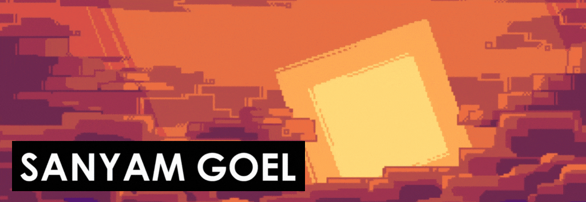

<h1 align="center">Namaste, I'm Sanyam 🙏</h1>

<h2 align="center">
A Web and Game Developer💻, Open Source Contributer⚔️ and A Space Nerd🚀!
</h2>  

I love making and playing video games. I have a passion to learn new technologies and share my knowledge with others as much as possible.I have a particular interest in space and physics. I love to understand how our universe works. My other interests are reading, football, music and coffee.

## 🔍Find me elsewhere:

&nbsp;&nbsp;

 

## 🤹Technical skills:

 

 

## 🪴Currently learning:

## ⚒️My projects:

- [A unity based interactive hand tracking game](https://github.com/hexwhiz/SIMI)
- [A GUI snake game using python](https://github.com/hexwhiz/blockSnake)
- [MyMoney Android App](https://github.com/hexwhiz/MyMoney-android)
- [Text manipulation website using django](https://github.com/hexwhiz/TextUtils)
- Find rest of my projects [here](https://github.com/hexwhiz?tab=repositories)

## 🎯Currently working on:

- null<!-- [An e-commerce website using django](https://github.com/iamsanyamgoel/Hexcart) -->

## ✍️Latest blog posts:

- [The Fantasy Terminal](https://dub.sh/thefantasyterminal)

## 🏅Holopins:

## 📈Github stats:

